  

  
  

### Hi, I'm Joshua 👋

I'm a software engineer at **Markel** by day. The rest of the time I build things that leave the screen: sensors on food pantry doors, a newspaper that prints itself onto a Kindle every morning, a monitor that tells my Arch box what is wrong with it before I find out the hard way.

I like software that has a physical consequence, runs on hardware I can hold, and still works when the network does not.

## 🔭 What I'm building

<table>
<tr>
<td width="50%" valign="top">

### 🥫 Little Ram Pantries

Free food pantries across VCU's campuses, each with a door sensor and a camera, so a student can check what is on the shelf before making the walk.

I lead the engineering: the public site (map, a page per pantry, works offline), the admin tools for restocking and outages, the device fleet, and the AWS accounts underneath.

`TypeScript` `Go` `AWS IoT Greengrass` `CloudFront`

**[littlerampantries.com →](https://littlerampantries.com/)**

</td>
<td width="50%" valign="top">

### 📰 MNN: Muse News Network

Your own daily newspaper on a jailbroken Kindle. Each morning the Kindle wakes to a front page, and the full edition is already waiting in KOReader.

A Raspberry Pi reads the feeds, builds the EPUB and serves it. One line to install.

`Python` `Docker` `KOReader` `e-ink`

</td>
</tr>
<tr>
<td width="50%" valign="top">

### 🩺 Archaholics Anonymous

`aa check`: a read-only health monitor for Arch Linux. It probes the system, ranks what it finds by severity, and hands you the exact command to fix each problem. It never changes anything itself.

`Python` `uv` `systemd` `pacman`

</td>
<td width="50%" valign="top">

### 🎬 motionStudio

Motion graphics made from code. A film is a deterministic program: seek to any time, get the exact frame. Headless Chromium paints it, ffmpeg encodes it, and the same film renders to 9x16, 1x1 and 16x9.

`JavaScript` `Playwright` `ffmpeg`

</td>
</tr>
</table>

## 🛫 In flight

Still private while they take shape.

<table>
<tr>
<td width="50%" valign="top">

### 🐉 Hydra

An orchestrator for coding agents, arranged as a tree: each orchestrator has a home of its own and hands work down to the ones beneath it. It runs on local workers first, with a second execution plane to follow.

`Python` `uv` `JSON Schema`

</td>
<td width="50%" valign="top">

### 🍕 FAFU: Food Alerts For You

Alerts students the moment free food is available nearby, so campus surplus becomes a meal instead of waste. The fastest path between leftover food and a hungry student.

`Go` `DynamoDB` `Terraform`

</td>
</tr>
</table>

## 🧰 Toolbox

  
   
  

## 🧭 How I work

- **Ship the whole thing.** Frontend, API, infrastructure, the device on the wall, and the release notes.
- **Read-only first.** Tools should explain and recommend before they are ever allowed to change state.
- **Local by default.** One command brings up the full stack with no cloud account.
- **Agents are teammates.** Most of my recent work is built alongside coding agents, with pipelines that check their output before it lands.

  Want to talk pantries, Kindles, or Arch? <a href="https://www.linkedin.com/in/joshua-hayes-vcu/">Find me on LinkedIn.</a>

